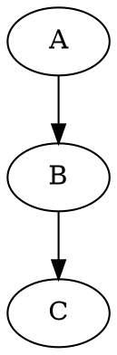
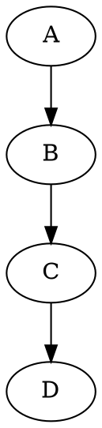
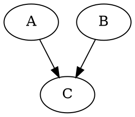

implexus-common
===============

A bunch of common stream factories that one could use to get up and running with implexus.

API
---

`value`
-------

This outputs a single value

### properties

-	`value` : Either a JSON value, or a string.

### example

This should output `"foo"` and `{bar:"baz"}` to the console or stdout

```dot
digraph {
	C[type=stdout];
	A[type=value value=foo] -> C;
	B[type=value value="{\"bar\":\"baz\"}"] -> C;
}
```

`stdout`
--------

Outputs input to either the console, or stdout.

### properties

-	`prefix` : A string to prefix all output with

### example

This shoudl output `Log:foo` to stdout.

```dot
digraph {
	A[type=value value=foo] -> B[type=stdout prefix="Log:"];
}
```

`array`
-------

This takes in an array of items that it will emit one by one

#### properties

-	`list` : A string that contains items split by commas. The items can be any valid JSON.

### example

This should output the items to stdout one by one.

```dot
digraph {
   A[type=array, list="1,2,3,4,5"] -> B[type=stdout];
}
```

`delay`
-------

Takes in arbitrary inputs, and outputs it after a given time.

### properties

-	`time` : The time in milliseconds to delay before outputting. Defaults to 1000 milliseconds.

### example

This should delay for 2 seconds and output the stdout.

```dot
digraph {
	A[type=delay time=2000] -> B[type="stdout"];
}
```

`concat`
--------

Concatenates inputted items and emits every time a new item is added

### properties

-	`initial` : The initial state of the array. A string that contains items split by commas. The items can be any valid JSON.

### example

This should build up an array and emit `[1]` `[1,2]` `[1,2,3]`

```dot
digraph {
	A[type=array, list="1,2,3"] -> B[type=concat] -> C[type=stdout];
}
```

`map`
-----

Processes incoming data with JavaScript and outputs the result.

### properties

-	`code` : Some JavaScript to execute on every piece of data. Within the code, you can reference `data` as the incoming data.

### example

This should go through a list of numbers and multiply them by two.



`websocket`
-----------

This creates a websocket to a given URL.

### properties

-	`url` : The URL to connect the websocket to.

### example

This should open a websocket and output everything from it to stdout.

```dot
digraph {
	A[type=websocket url="ws://example.com"] -> B[type=stdout];
}
```

`toJSON`
--------

Converts incoming data to a JSON string. Each JSON item is separated by a newline.

### example

This should convert an object into a JSON string.


`fromJSON`
----------

Converts incoming JSON strings into objects.

### example

This will convert data from a websockt into objects, and then output them to stdout.


`debounce`
----------

Limits the number of times it emits data.

### properties

-	`interval` : How frequently it lets data through. Once the interval is over, it'l output the most recent bit of data. The default is 1000 milliseconds.

### example

This will output every other item in the array. Should output `1`, `4`.



`merge`
-------

Merges inputted objects together.

### properties

-	`state` : The initial state to merge with. A JSON string. An empty object by default.
-	`depth` : The depth at which to merge with. Merges fully by default.

### examples

This should merge the two values together, and output whatever one emits first, and then the two merged together.



`getProp`
---------

TODO: Document this

`makeProp`
----------

TODO: Document this
